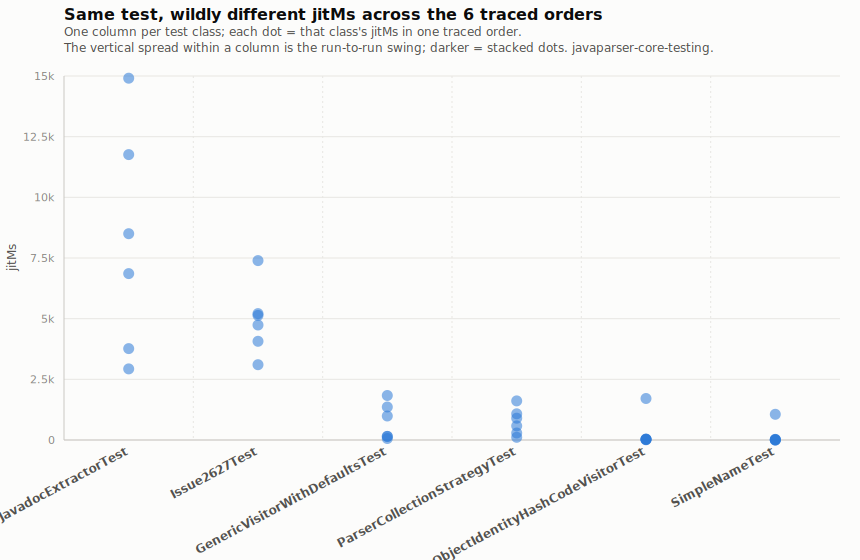
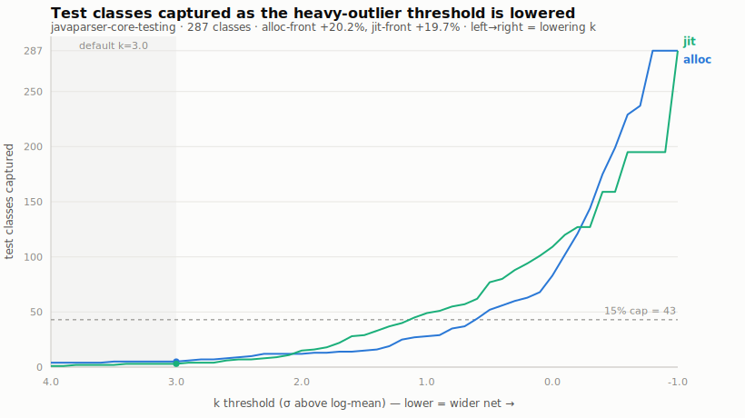

# JIT vs. Alloc Overlap Analysis

This report documents the correlation and overlap between the heaviest memory allocators (targeted by `alloc-front` / `alloc-sort`) and the heaviest JIT compilation tests (targeted by `jit-front` / `jit-sort`) across five target modules.

## Overlap Findings (Top 10 Classes)

Across all scanned modules, there is a consistent **70% to 90% overlap** between the top 10 allocators and the top 10 compilation-heavy test classes. This could indicate the ability to remove either jit methods or alloc methods as a candidate.

---

### 1. `javaparser-core-testing`
*   **Total Tracked Tests**: 287
*   **Overlap in Top 10**: **7 / 10 (70%)**
*   **Shared Top 10 Classes**:
    *   `JavadocExtractorTest` (Alloc Rank #1, JIT Rank #1)
    *   `BulkParseTest` (Alloc Rank #2, JIT Rank #2)
    *   `Issue2627Test` (Alloc Rank #3, JIT Rank #3)
    *   `GenericVisitorWithDefaultsTest` (Alloc Rank #6, JIT Rank #4)
    *   `GenericListVisitorAdapterTest` (Alloc Rank #4, JIT Rank #5)
    *   `ParserCollectionStrategyTest` (Alloc Rank #5, JIT Rank #6)
    *   `ObjectIdentityHashCodeVisitorTest` (Alloc Rank #7, JIT Rank #8)

---

### 2. `javaparser-symbol-solver-testing`
*   **Total Tracked Tests**: 294
*   **Overlap in Top 10**: **9 / 10 (90%)**
*   **Shared Top 10 Classes**:
    *   `SymbolSolverCollectionStrategyTest` (Alloc Rank #3, JIT Rank #1)
    *   `JavaParserClassDeclarationTest` (Alloc Rank #1, JIT Rank #2)
    *   `JavaParserTypeSolverTest` (Alloc Rank #5, JIT Rank #3)
    *   `JavaParserEnumDeclarationTest` (Alloc Rank #4, JIT Rank #4)
    *   `SymbolSolverTest` (Alloc Rank #6, JIT Rank #5)
    *   `Issue3038Test` (Alloc Rank #8, JIT Rank #6)
    *   `JavaParserInterfaceDeclarationTest` (Alloc Rank #2, JIT Rank #7)
    *   `MethodReferenceResolutionTest` (Alloc Rank #9, JIT Rank #8)
    *   `MethodsResolutionLogicTest` (Alloc Rank #7, JIT Rank #9)

---

### 3. `commons-lang`
*   **Total Tracked Tests**: 394
*   **Overlap in Top 10**: **8 / 10 (80%)**
*   **Shared Top 10 Classes**:
    *   `ExtendedMessageFormatTest` (Alloc Rank #3, JIT Rank #1)
    *   `FastDateParserTest` (Alloc Rank #2, JIT Rank #2)
    *   `FastDateParser_TimeZoneStrategyTest` (Alloc Rank #1, JIT Rank #3)
    *   `FastDateParserJava15BugTest` (Alloc Rank #6, JIT Rank #4)
    *   `DurationFormatUtilsTest` (Alloc Rank #4, JIT Rank #5)
    *   `HashCodeBuilderAndEqualsBuilderTest` (Alloc Rank #10, JIT Rank #6)
    *   `LocaleUtilsTest` (Alloc Rank #7, JIT Rank #7)
    *   `ClassUtilsOssFuzzTest` (Alloc Rank #5, JIT Rank #10)

---

### 4. `commons-text`
*   **Total Tracked Tests**: 24
*   **Overlap in Top 10**: **7 / 10 (70%)**
*   **Shared Top 10 Classes**:
    *   `ExtendedMessageFormatTest` (Alloc Rank #1, JIT Rank #1)
    *   `StringSubstitutorWithInterpolatorStringLookupTest` (Alloc Rank #4, JIT Rank #2)
    *   `ResourceBundleStringLookupTest` (Alloc Rank #6, JIT Rank #3)
    *   `OssFuzzTest` (Alloc Rank #2, JIT Rank #4)
    *   `TextStringBuilderAppendInsertTest` (Alloc Rank #5, JIT Rank #5)
    *   `StringEscapeUtilsTest` (Alloc Rank #3, JIT Rank #7)
    *   `RandomStringGeneratorTest` (Alloc Rank #8, JIT Rank #9)

---

### 5. `jackson-core`
*   **Total Tracked Tests**: 215
*   **Overlap in Top 10**: **8 / 10 (80%)**
*   **Shared Top 10 Classes**:
    *   `DoubleToDecimalTest` (Alloc Rank #3, JIT Rank #1)
    *   `NextXxxAccessTest` (Alloc Rank #8, JIT Rank #2)
    *   `AsyncConcurrencyTest` (Alloc Rank #9, JIT Rank #4)
    *   `GeneratorMiscTest` (Alloc Rank #7, JIT Rank #5)
    *   `NumberOutputTest` (Alloc Rank #6, JIT Rank #6)
    *   `FloatToDecimalTest` (Alloc Rank #2, JIT Rank #7)
    *   `Fuzz51806JsonPointerParse818Test` (Alloc Rank #1, JIT Rank #9)
    *   `StringGenerationFromReaderTest` (Alloc Rank #5, JIT Rank #10)

---

## Top allocators / runtime (rt) overlap

The package-level candidate orders `pkg-alloc-front` and `pkg-rt-front` share an identical first 6 classes because the packages `com.github.javaparser.javadoc`, `com.github.javaparser.manual`, and `com.github.javaparser.issues` rank highest on both aggregate allocation and runtime metrics.

### Package-Level Metrics (Javaparser Core)

| Package | Agg. Alloc (Rank) | Agg. Runtime (Rank) |
|---|---|---|
| `com.github.javaparser.javadoc` | 7432.73 MB (**#1**) | 5361.00 ms (**#1**) |
| `com.github.javaparser.manual` | 3714.27 MB (**#2**) | 1968.00 ms (**#2**) |
| `com.github.javaparser.issues` | 1820.01 MB (**#3**) | 1018.50 ms (**#3**) |
| `com.github.javaparser.utils` | 203.44 MB (**#4**) | 323.50 ms (**#5**) |
| `com.github.javaparser.ast.visitor` | 165.66 MB (**#6**) | 482.50 ms (**#4**) |
| `com.github.javaparser.printer.lexicalpreservation` | 200.84 MB (**#5**) | 261.50 ms (**#6**) |

---

## Case Study: Locality/Package Sensitivity vs. JIT/Alloc Performance

The following tables compare the raw median runtimes (ms) and the relative speedups (%) of local perturbation (`-front`) vs. global sorting (`-sort`) strategies for both `javaparser-core-testing` and `jackson-core`, illustrating the impact of package-level locality sensitivity vs. global ordering.

### Relative Speedup vs. Initial Baseline (%)

| Candidate Strategy | Javaparser Speedup | Jackson Speedup |
| :--- | :--- | :--- |
| `initial` | 0.00% (Baseline) | 0.00% (Baseline) |
| `alloc-front` (local) | **+20.19%** | +5.31% |
| `alloc-sort` (global) | +17.80% | -1.88% |
| `jit-front` (local) | +19.70% | +1.90% |
| `jit-sort` (global) | +16.22% | **+5.81%** |

## Caveat: per-test `jitMs` is mostly position, not the test

Each test's jitMs is normalized to its own max across the 6 traced orders; the binned median falls from 0.80 (run early/cold) to 0.14 (run late/warm), so a single reading mostly encodes *where the test ran*, not what it costs. `SimpleNameTest` is the extreme case (1058 ms at position 1, ~0 everywhere else); the median-of-shuffles used by `jit-sort` survives only via the exclusive-compilation floor of the heavies, which is a correlation, not a mechanism — a drop metric (max − min) would measure the shareable compilation directly.

## Threshold sensitivity: classes captured vs. `k`

`alloc-front`/`jit-front` flag a class heavy when its signal, on a log scale, sits more than `k` standard deviations above the suite mean (`heavyOutliers` in `Candidates.java`). The chart below sweeps `k` for `javaparser-core-testing` (the one module where both `-front` strategies win): at the shipped default `k=3.0` it captures 5 classes (alloc) / 3 (jit), and the two curves track each other closely all the way down — the same alloc/JIT overlap seen in the top-10 tables. Capture saturates at all 287 classes near `k ≈ -0.8`; the 15% relocation cap (43 classes) is the ceiling any single move relocates.

# Conclusion

This overlap was going to be used to justify removing either jit or alloc methods. This would make the analysis faster. However, the jackson-core vs. javaparser-core-testing case study disproves this (because alloc-sort is -1.88% while jit-sort is +5.81%). More research is needed.